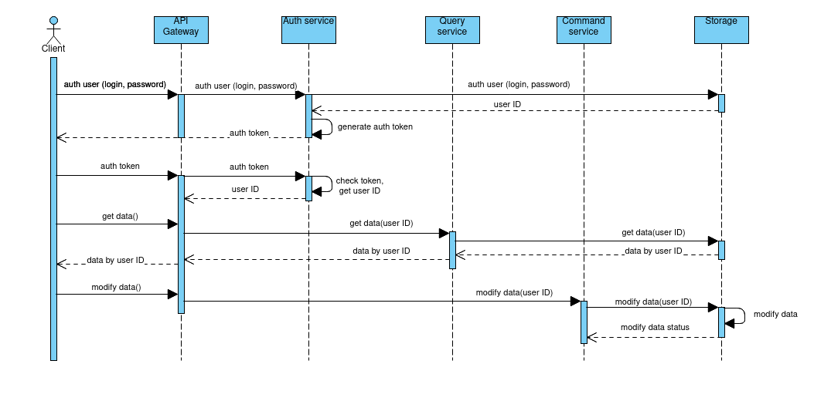

## Менеджер паролей GophKeeper

GophKeeper представляет собой клиент-серверную систему, позволяющую пользователю надёжно и безопасно хранить логины, пароли, бинарные данные и прочую приватную информацию.

## Бизнес требования

Сервер должен реализовывать следующую бизнес-логику:
- регистрация, аутентификация и авторизация пользователей;
- хранение приватных данных;
- синхронизация данных между несколькими авторизованными клиентами одного владельца;
- передача приватных данных владельцу по запросу.

Клиент должен реализовывать следующую бизнес-логику:
- аутентификация и авторизация пользователей на удалённом сервере;
- доступ к приватным данным по запросу.

## Контекст исполнения и его ограничения

- кроссплатформенность клиента;
- количество одновременно работающих клиентов > 1000;
- запрос обрабатывается менее чем за 1с;
- размер одной записи хранимой информации не превышает 512 kB.

## Архитектура

Микросервисная архитектура с разделением команд и запросов (сommand-query separation). 
Система состит из нескольких сервисов:
- API Gateway service;
- Auth service;
- Query service;
- Command producer service;
- Брокер сообщений (опционально);
- Command consumer service;
- Хранилище данных.

## Описание компонент сервиса

#### Клиент 

Реализует аутентификацию и авторизацию пользователя на удалённом сервисе. Осуществляет доступ к приватным данным по запросу.
Типы хранимой информации:
- пары логин/пароль;
- произвольные текстовые данные;
- произвольные бинарные данные;
- данные банковских карт.
Перечисленные выше типы информации являются защищаемыми, соответственно, с целью ограничения несанкционированного доступа к защищаемой информации шифрование типов осуществляется на клиенте. 
Для любых данных должна быть возможность хранения произвольной текстовой метаинформации (принадлежность данных к веб-сайту, личности или банку, списки одноразовых кодов активации и прочее). 
Ограничение доступа к метаинформации реализуется на основе имени пользователя и пароля в системе.

#### API Gateway service

Представляет внешним клиентам общий интерфейс взаимодействия с системой. Маршрутизация запросов между сервисами.

#### Auth service

Служба принимает имя пользователя и пароль от API Gateway. Аутентификация пользователя осуществляется посредством имени пользователя и пароля. При успешной аутентификации сервис предоставляет пользователю JWT-токен, в API Gateway сервис возвращает user ID. Так же осуществляет десериализацию выданных ранее JWT-токенов с целью проверки подлинности токена и выделением user ID.

#### Query service

Служба принимает от API Gateway критерий для запроса в хранилище, возвращает формализованный ответ. 

#### Command service

Служба состоит из Command producer service, брокера сообщений и Command consumer service. Взаимосвязь command producer и command consumer посредством настройки конфигурации может быть организована через брокер сообщений. 
Command producer принимает запрос на модификацию данных в хранилище (добавление, изменение, удаление), вычисляет hash от значения user ID, вычисленное значение hash-функции используется для формирования и отправки сообщения брокеру.

Command consumer осуществляет опрос брокера сообщений. При получении сообщения осуществляет его десереализацию. В соответствии с полученной информацией осуществляется модификация набора данных в хранилище. 

## Особенности реализации

- для разработки и написания сервисов (за исключением брокера сообщений) используется язык Golang;
- в качестве брокера сообщений использован Apache Kafka;
- взаимодействие между сервисами осуществляется по gRPC-протоколу;
- сервис аутентификации имеет отдельное хранилище от защищаемых данных, реализованное на PostgreSQL;
- хранилище защищаемой информации реализованно на базе кластера master/slave на PostgreSQL;
- актуальность данных на slave - ноде поддерживается за счёт репликации данных с master - ноды;
- Command service изменяет данные на master - ноде PostgreSQL;
- Query service осуществляет запросы только к slave - ноде PostgreSQL. 